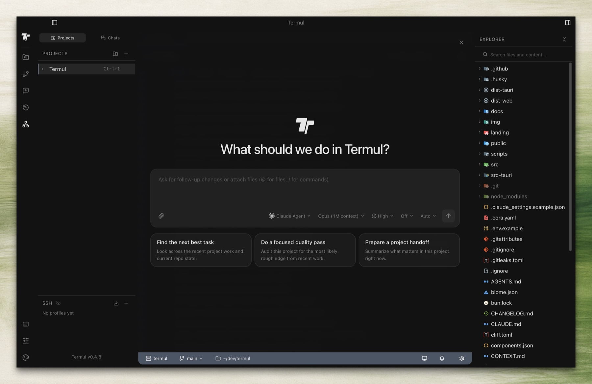
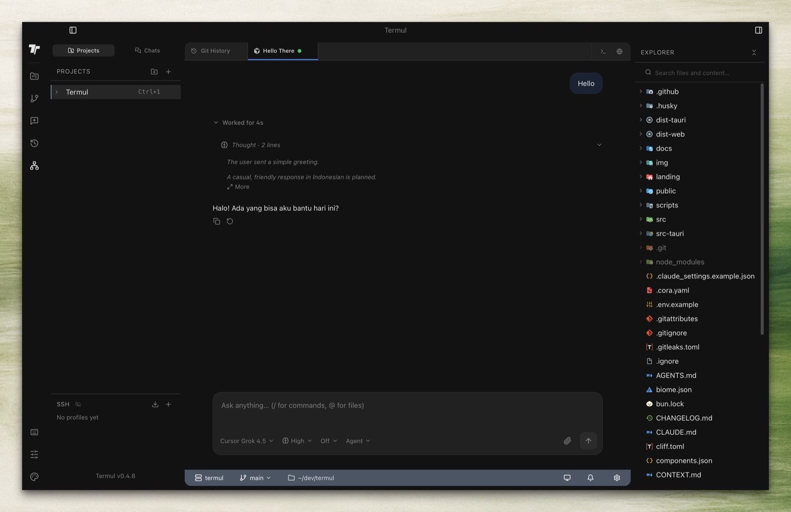
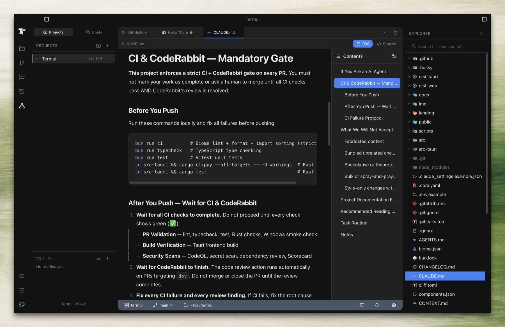
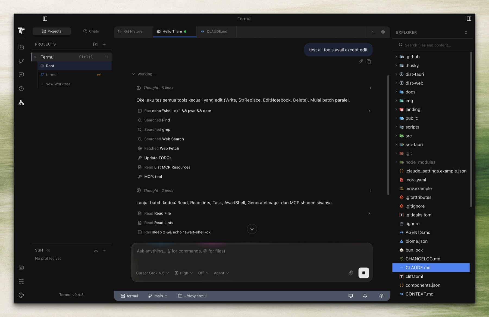
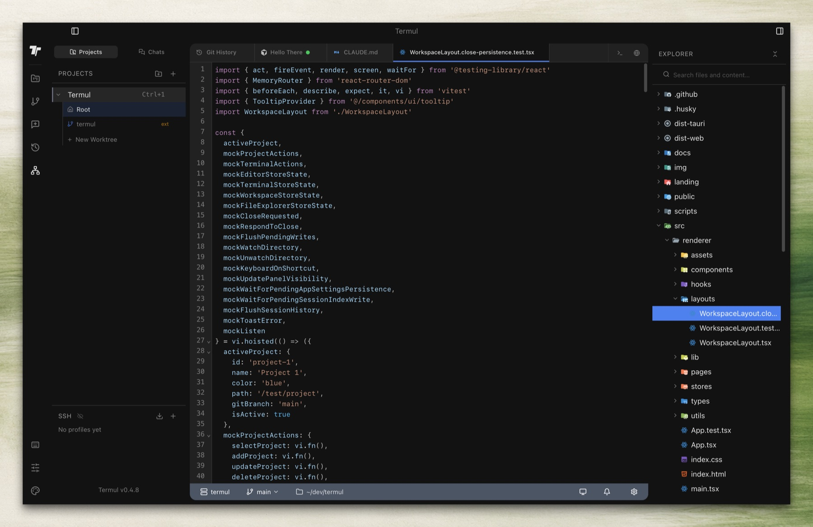
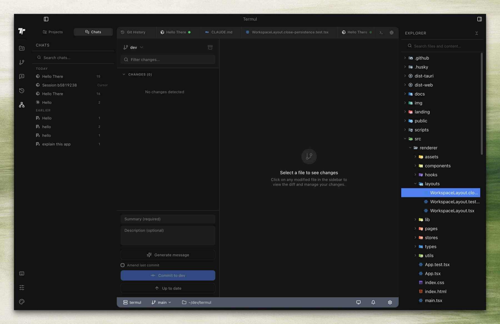
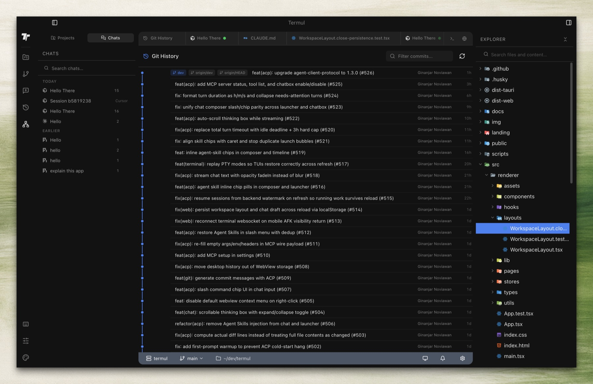

<div align="center">


# Se Manager

**A project-aware workspace for terminals, agents, and remote pairing.**

Se 把项目当一等公民：桌面终端、ACP 对话、Skills Hub，以及可扫码接入的 iOS / 浏览器远程。

GitHub 仓库仍叫 [`qinsehm1128/termul-new`](https://github.com/qinsehm1128/termul-new)（历史名称）。产品名、图标与文档统一为 **Se Manager**。

_An independent project — not a GitHub fork. Derived from [gnoviawan/termul](https://github.com/gnoviawan/termul) under the MIT License; see [License & Provenance](#-license--provenance)._

[](https://github.com/qinsehm1128/termul-new/stargazers)
[](https://github.com/qinsehm1128/termul-new/issues)
[](LICENSE)
[](https://github.com/qinsehm1128/termul-new/releases)

[](https://github.com/qinsehm1128/termul-new)
[](https://tauri.app)
[](https://react.dev)
[](https://www.typescriptlang.org)

[Getting Started](#-getting-started) · [What Se adds](#-what-se-adds) · [Features](#-features) · [Documentation](#-documentation) · [Contributing](CONTRIBUTING.md) · [Report Bug](https://github.com/qinsehm1128/termul-new/issues/new?template=bug_report.md) · [Request Feature](https://github.com/qinsehm1128/termul-new/issues/new?template=feature_request.md)

</div>

---

## 🚀 What Se adds

These are the capabilities built on top of the original Termul workspace — not just a rename.

这些是相对原版 Termul 新增的产品能力。

| Area | What you get |
| ---- | ------------ |
| **ACP agent chat** | Conversations with Cursor, Codex, Claude, OpenCode and other ACP agents live next to the terminal. Plans, permissions, attachments, and session restore stay on the host. |
| **Skills Hub** | Browse, project, and repair skills. Preview GitHub / npm / HTTPS sources as background jobs, then install to **Global** or any registered project with a path. |
| **Shared-live remote** | The desktop (or `se-server`) hosts agents and PTYs. A browser client and the iOS app attach to the same session over LAN or a tunnel. |
| **HTTP reverse pairing** | Remote Access publishes an HTTP QR (token in the URL fragment). Import `~/.ssh/config` hosts, use password / `SSH_ASKPASS`, optional identity file, and bind `0.0.0.0` for SSH reverse tunnels. |
| **Se Remote (iOS)** | Native SwiftUI companion — Chat, Terminal, project switching, read-only files. No WebView. Pair by QR or paste. English / 简体中文. |
| **Standalone `se-server`** | Headless host with the same web client. linux-x64 builds ship on GitHub Releases for self-hosting. |
| **Memory index** | Search local agent history without copying corpora into the project tree. |
| **Scheduled tasks** | Recurring / delayed workspace jobs from a conversation. |
| **Live project list** | `GET /projects` annotates `liveTerminalCount`. Phone and web group running vs idle projects. |
| **i18n** | Desktop and web UI in English and Simplified Chinese; iOS follows system / EN / 简体中文. |

Switching projects does **not** kill live PTY sessions. The same Rust services back desktop Tauri, shared-live remote, `se-server`, and the browser/phone UI.

## ✨ Features

### 🪟 Workspace & Terminal Management

| Feature                      | Description                                                                                                       |
| ---------------------------- | ----------------------------------------------------------------------------------------------------------------- |
| **Project-Based Workspaces** | Organize terminals by project with dedicated workspace directories, separate state, and per-project configuration |
| **Pane-Based Split Layout**  | Split your workspace into resizable panes and arrange terminals, editors, and browser tabs side by side           |
| **Tabbed Interface**         | Windows Terminal-style tab bar with drag-and-drop reordering, rename, and context menu                            |
| **Multiple Shell Support**   | Auto-detects PowerShell, CMD, Git Bash, WSL, fish, zsh, and more; switch shells per tab                           |

### 📝 Editor & File Management

| Feature              | Description                                                                                             |
| -------------------- | ------------------------------------------------------------------------------------------------------- |
| **Code Editor**      | Built-in code editor with syntax highlighting, file buffers, dirty-state tracking, and save/reload      |
| **Markdown Editor**  | Rich markdown editing powered by BlockNote with live preview, table of contents, and heading navigation |
| **Mermaid Diagrams** | Render Mermaid diagrams inline within your markdown documents                                           |
| **File Explorer**    | Full file tree with create, rename, delete, clipboard operations, drag-and-drop, and context menus      |
| **File Watching**    | Live file watching for real-time updates as files change on disk                                        |

### 🌐 Browser & Annotation

| Feature                   | Description                                                                               |
| ------------------------- | ----------------------------------------------------------------------------------------- |
| **Embedded Browser Tabs** | Browse the web directly inside your workspace using child webview tabs — no app switching |
| **Annotation Workflow**   | Capture browser states, annotate with severity and intent labels, review, and export      |
| **Annotation Export**     | Package annotations with metadata into structured export formats                          |

### ⚡ Power User Tools

| Feature                | Description                                                                                            |
| ---------------------- | ------------------------------------------------------------------------------------------------------ |
| **Command Palette**    | Global command launcher (`Ctrl+K` / `Ctrl+Shift+P`) for project switching, workspace actions, and more |
| **Command History**    | Per-project and aggregate command history viewer with search                                           |
| **Keyboard Shortcuts** | Fully customizable shortcut bindings for every action                                                  |
| **Git Integration**    | Status bar shows current branch, working directory, git status, and exit code                          |
| **Custom Title Bar**   | Desktop-native title bar with window controls, sidebar toggles, and settings navigation                |

### 🤖 Agents, Skills & Memory

| Feature              | Description                                                                                                  |
| -------------------- | ------------------------------------------------------------------------------------------------------------ |
| **ACP Conversations** | In-workspace chat with ACP agents (Cursor, Codex, Claude, OpenCode, …); plans, tool permissions, attachments |
| **Skills Hub**        | Catalog, project, and repair skills; remote GitHub / npm / URL preview jobs; install to Global or a project  |
| **Memory Index**      | Host-private search over local agent history                                                                 |
| **Scheduled Tasks**   | Recurring and delayed jobs from a conversation                                                               |

### 📡 Remote, Server & iOS

| Feature                    | Description                                                                                         |
| -------------------------- | --------------------------------------------------------------------------------------------------- |
| **Shared-live host**       | Desktop publishes the live session; browser and phone attach without owning a PTY                   |
| **Reverse-tunnel QR**      | HTTP pairing URL with the access token in the fragment; Cloudflare / FRP / SSH reverse              |
| **SSH config import**      | Pick a host from `~/.ssh/config`; password, `SSH_ASKPASS`, or identity file                         |
| **`se-server`**            | Standalone headless host + the same web client                                                      |
| **Se Remote**              | Native iOS app (`ios/SeRemote`) — Chat, Terminal, projects, files; see [ios/README.md](ios/README.md) |
| **English / 简体中文**     | Renderer, web, and iOS strings                                                                      |

### 🔧 System & Reliability

| Feature                   | Description                                                                                                               |
| ------------------------- | ------------------------------------------------------------------------------------------------------------------------- |
| **Auto-Updater**          | Built-in update infrastructure with signed artifacts — get notified and update without leaving the app                    |
| **State Management**      | Zustand-powered reactive stores for projects, terminals, workspace layout, editor buffers, browser sessions, and settings |
| **Configurable Settings** | Terminal and UI preferences, color picker, theme customization, and shell configuration                                   |
| **Cross-Platform**        | Works on Windows, macOS, and Linux with native platform packaging                                                         |
| **Error Boundaries**      | Graceful error handling with runtime error boundaries and user-friendly fallback UI                                       |

<details>
<summary>🗺️ Feature Map — Component Overview</summary>

| Domain            | Key Components                                                                     | Zustand Store                                      |
| ----------------- | ---------------------------------------------------------------------------------- | -------------------------------------------------- |
| **Workspace**     | `WorkspaceLayout`, `PaneRenderer`, `PaneContent`, `WorkspaceTabBar`                | `workspace-store`                                  |
| **Terminal**      | `ConnectedTerminal`, `TerminalSearchBar`, `ActivityIndicator`                      | `terminal-store`                                   |
| **Editor**        | `EditorPanel`, `CodeEditor`, `MarkdownEditor`, `EditorToolbar`, `MermaidBlock`     | `editor-store`                                     |
| **Browser**       | `BrowserPanel`, `BrowserControls`, `AnnotationPanel`, `AnnotationExportModal`      | `browser-session-store`, `annotation-store`        |
| **File Explorer** | `FileExplorer`, `FileTreeNode`, `FileTreeContextMenu`                              | —                                                  |
| **Snapshots**     | `CreateSnapshotModal`, `RestoreSnapshotModal`, `DeleteSnapshotModal`               | `snapshot-store`                                   |
| **Projects**      | `ProjectSidebar`, `NewProjectModal`                                                | `project-store`                                    |
| **Agent Chat**    | `AgentChatPanel`, `ChatMessage`, `ChatInputBar`                                    | conversation / ACP stores                          |
| **Skills**        | `Skills` page, install-target picker                                               | —                                                  |
| **Remote Access** | `RemoteAccessSettings`, tunnel QR, SSH reverse                                     | —                                                  |
| **Settings**      | `ShortcutRecorder`, `ColorPickerPopover`, `ContextBarSettingsPopover`              | `app-settings-store`, `context-bar-settings-store` |
| **Updates**       | `UpdateAvailableToast`, `UpdateReadyModal`                                         | `updater-store`                                    |
| **Shared**        | `CommandPalette`, `ContextMenu`, `ConfirmDialog`, `ShellSelector`, `ErrorBoundary` | —                                                  |

</details>

## 📸 Screenshots

### Home



### Agent Chat



### Markdown Editor



### Agent Tools



### Code Editor



### Git Panel



### Git History



## 📦 Install

Released builds target **macOS on Apple Silicon** and **Windows x64**. Intel Macs and
Linux desktops are not published — build from source (see [Getting Started](#-getting-started)).
A headless `se-server` for linux-x64 is published separately for self-hosting.

### macOS (Apple Silicon)

```bash
curl -fsSL https://raw.githubusercontent.com/qinsehm1128/termul-new/main/scripts/install.sh | bash
```

### Windows

Install the `.exe` or `.msi` from [GitHub Releases](https://github.com/qinsehm1128/termul-new/releases).

Manual DMG downloads in a browser may still hit Gatekeeper, so macOS users should prefer the curl installer.

> **Homebrew is not published yet.** The release pipeline can push a cask, but this
> project does not run a tap. The workflow stays skipped until the `HOMEBREW_TAP`
> repository variable and `HOMEBREW_TAP_TOKEN` secret are configured.

## 🚀 Getting Started

### Prerequisites

| Dependency                                      | Version       | Notes                                  |
| ----------------------------------------------- | ------------- | -------------------------------------- |
| [Bun](https://bun.sh)                           | 1.3+          | JavaScript runtime and package manager |
| [Rust](https://www.rust-lang.org/tools/install) | Latest stable | Required for Tauri builds              |

#### Platform-Specific Requirements

<details>
<summary>Windows</summary>

- Microsoft Visual C++ Build Tools (included in Visual Studio 2022)
- [WebView2 Runtime](https://developer.microsoft.com/en-us/microsoft-edge/webview2/) (pre-installed on Windows 10+)

</details>

<details>
<summary>macOS</summary>

```bash
xcode-select --install
```

</details>

<details>
<summary>Linux (Debian/Ubuntu)</summary>

```bash
sudo apt update
sudo apt install libwebkit2gtk-4.1-dev \
    build-essential curl wget file \
    libxdo-dev libssl-dev \
    libayatana-appindicator3-dev \
    librsvg2-dev patchelf
```

</details>

<details>
<summary>Linux (Fedora)</summary>

```bash
sudo dnf install webkit2gtk4.1-devel \
    gcc gcc-c++ libopenssl-devel \
    appindicator-devel librsvg2-devel \
    patchelf
```

</details>

### Install Rust Toolchain

```bash
curl --proto '=https' --tlsv1.2 -sSf https://sh.rustup.rs | sh
rustc --version && cargo --version
```

### Quick Start

```bash
# Clone the repository
git clone https://github.com/qinsehm1128/termul-new.git
cd termul-new

# Install dependencies
bun install

# Launch in development mode
bun run dev
```

### iOS companion

The native SwiftUI client lives in `ios/SeRemote`. Pairing, language, and terminal notes: [ios/README.md](ios/README.md).

### Building for Production

```bash
# Build for your current platform
bun run build

# Platform-specific builds
bun run build:tauri:win        # Windows (x64)
bun run build:tauri:mac-arm    # macOS (Apple Silicon)
bun run build:tauri:mac-x64    # macOS (Intel)
bun run build:tauri:linux      # Linux (x64)

# Debug build (faster compilation, larger binary)
bun run build:tauri:debug
```

Build output: `src-tauri/target/release/bundle/`

## 📖 Documentation

### Usage

#### Creating a Project

1. Click the **+** button in the sidebar to create a new project
2. Select a workspace directory
3. Configure your default shell (optional)

#### Terminal Tabs

| Action                | How                                       |
| --------------------- | ----------------------------------------- |
| New terminal          | Click **+** next to tabs                  |
| Select specific shell | Click the dropdown arrow                  |
| Reorder tabs          | Drag and drop                             |
| Rename tab            | Double-click the tab                      |
| Context menu          | Right-click (rename, close, kill process) |

#### Keyboard Shortcuts

| Action          | Default Shortcut          |
| --------------- | ------------------------- |
| New Terminal    | `Ctrl+T`                  |
| Next Tab        | `Ctrl+PageDown`           |
| Previous Tab    | `Ctrl+PageUp`             |
| Command Palette | `Ctrl+K` / `Ctrl+Shift+P` |

> Shortcuts are customizable in Settings. On Tauri/WebView2, browser-reserved shortcuts such as `Ctrl+Tab` are not used as defaults because they are not reliably interceptable.

### Architecture

#### Tech Stack

| Layer              | Technology                                                                           |
| ------------------ | ------------------------------------------------------------------------------------ |
| Desktop Runtime    | [Tauri 2.0](https://tauri.app)                                                       |
| Backend            | [Rust](https://www.rust-lang.org)                                                    |
| UI Framework       | [React 18](https://react.dev)                                                        |
| Type System        | [TypeScript](https://www.typescriptlang.org)                                         |
| Build Tool         | [Vite](https://vitejs.dev)                                                           |
| Styling            | [Tailwind CSS](https://tailwindcss.com) + [shadcn/ui](https://ui.shadcn.com)         |
| State Management   | [Zustand](https://zustand-demo.pmnd.rs)                                              |
| Terminal Emulation | Rust [`portable-pty`](https://crates.io/crates/portable-pty) + [xterm.js](https://xtermjs.org) |
| Animations         | [Framer Motion](https://www.framer.com/motion)                                       |

#### Tauri Plugins

| Plugin                                 | Purpose                   |
| -------------------------------------- | ------------------------- |
| `@tauri-apps/plugin-fs`                | Filesystem access         |
| `@tauri-apps/plugin-store`             | Configuration persistence |
| `@tauri-apps/plugin-os`                | OS information            |
| `@tauri-apps/plugin-dialog`            | Native dialogs            |
| `@tauri-apps/plugin-clipboard-manager` | Clipboard operations      |
| `@tauri-apps/plugin-updater`           | Automatic updates         |
| `@tauri-apps/plugin-process`           | Process management        |

#### Project Structure

```text
src/
├── renderer/           # React frontend (desktop + web client)
│   ├── components/
│   ├── hooks/
│   ├── lib/            # Tauri / web facades (no direct @tauri-apps in UI)
│   ├── locales/        # en + zh-CN
│   ├── pages/          # Skills, ScheduledTasks, settings, …
│   └── stores/
├── shared/             # Runtime-neutral contracts (incl. brand)
src-tauri/              # Rust: desktop, se-server, shared-live host, web API
ios/SeRemote/           # Native iOS companion
docs/                   # Architecture and contributor docs
```

#### Platform Adapters

The renderer uses an adapter/service layer to keep desktop integrations isolated from UI code:

```text
src/renderer/lib/
├── tauri-*.ts        # Tauri-native integrations
├── *.ts              # Runtime-safe facades & helpers
└── __tests__/        # Regression & parity coverage
```

## 🛠️ Development

```bash
bun run dev              # Development mode with hot reload
bun run test             # Run tests
bun run test:watch       # Tests in watch mode
bun run typecheck        # Type checking
bun run lint             # Linting
bun run tauri <command>  # Direct Tauri CLI access
```

## SSH Development Notes

- SSH passwords and key passphrases are stored through the OS keychain, not in `ssh-profiles.json`.
- Active SSH sessions may retain the relevant secret in process memory only to support automatic reconnect; use SSH agent authentication to avoid runtime secret retention.
- Interactive SSH terminals use OpenSSH's default known-hosts file with `StrictHostKeyChecking=accept-new`; do not override `UserKnownHostsFile` to `/dev/null`/`NUL` because that disables persistent host-key verification.
- Local port forwarding uses `ssh2` `channel_direct_tcpip` over the active SSH session; remote/reverse forwarding is not supported by the MVP command path yet.
- `ssh2` vendors OpenSSL only for macOS targets so packaged `.app` bundles do not depend on Homebrew or build-runner library paths.
- Windows and Linux retain `ssh2`'s system/default OpenSSL behavior. Do not enable `vendored-openssl` globally: its local source build can fail in common Windows/MSYS environments without a complete Perl module setup.

## ⭐ Star History

[](https://www.star-history.com/?type=date&repos=qinsehm1128%2Ftermul-new)

## 🤝 Contributing

Contributions are welcome! Please read the [Contributing Guide](CONTRIBUTING.md) for details on our code of conduct and the process for submitting pull requests.

## 📄 License & Provenance

This project is licensed under the MIT License — see the [LICENSE](LICENSE) file for details.

### Independent project

`qinsehm1128/termul-new` is developed and released **independently**. It is not a GitHub
fork, it does not track an upstream remote, and it is not affiliated with or endorsed by
the original authors. Issues, pull requests and releases for this project belong here;
please do not report them upstream.

### Derived from

The codebase originates from [gnoviawan/termul](https://github.com/gnoviawan/termul),
released under the MIT License. As the MIT License requires, the original copyright
notice and permission notice are retained verbatim in [LICENSE](LICENSE):

```
Copyright (c) 2025 gnoviawan
Copyright (c) 2026 mannnrachman (Tauri porting contributions)
```

Credit for the original work belongs to its authors and contributors. The `contributors`
field in `package.json` is kept as an attribution roll for that work; it is not a claim
of authorship by this project.

## 🙏 Acknowledgments

Se Manager stands on a lot of good work. Thank you:

- [gnoviawan](https://github.com/gnoviawan) — original [Termul](https://github.com/gnoviawan/termul)
- [mannnrachman](https://github.com/mannnrachman) — Tauri port that this tree grew from
- [Windows Terminal](https://github.com/microsoft/terminal) — tab-bar UX
- [Hyper](https://github.com/vercel/hyper) — extensible terminal ideas
- [xterm.js](https://github.com/xtermjs/xterm.js) — renderer terminal
- [SwiftTerm](https://github.com/migueldeicaza/SwiftTerm) — iOS terminal emulator
- [Agent Client Protocol](https://agentclientprotocol.com/) — agent chat wire format
- [shadcn/ui](https://ui.shadcn.com/) — UI primitives
- [Tauri](https://tauri.app/) — desktop runtime
- [BlockNote](https://www.blocknotejs.org/) — markdown editor

---

<div align="center">


**Se Manager** · maintained by [qinsehm1128](https://github.com/qinsehm1128)

Originally created by [gnoviawan](https://github.com/gnoviawan) · Tauri port by [mannnrachman](https://github.com/mannnrachman)

</div>
