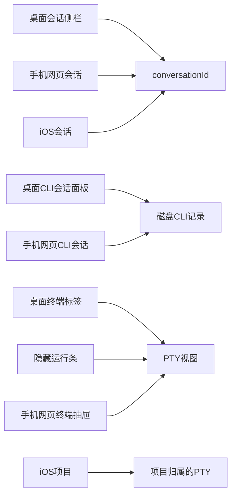

# 会话列表与终端列表盘点

**状态：** 后续改列表界面的依据。共享行语言、CLI 面板、会话侧栏、隐藏终端、手机网页抽屉和 iOS 行已按此顺序落地；关视图 / 结束进程语义未改。

**已锁定的实现顺序：** 共享列表组件 → CLI 会话面板 → 会话侧栏 → 终端列表 → 手机网页 → iOS。

Se 里其实有三套不同的列表，外加两块附属界面。难看的原因也不一样。Orca 最接近的对照物是「Agent Session History / AI Vault」，不是会话侧栏。Se 已经有一个更瘦的同类面板（`CliSessionPanel`）。把 Orca 的保险库行样式直接套到会话行上，会把两种身份混在一起。

## 有哪些列表

| 界面 | 文件 | 列的是什么 | 身份 |
|---|---|---|---|
| 桌面会话 | `src/renderer/components/conversation/ConversationSidebar.tsx`、`ConversationList.tsx` | Se 会话 | `conversationId` |
| 桌面 CLI 会话 | `src/renderer/components/cli-sessions/CliSessionPanel.tsx` | Claude / Codex / Cursor 等磁盘记录 | 文件路径 + 智能体 |
| 桌面终端标签 | `src/renderer/components/TerminalTabBar.tsx` | 已打开的 PTY 视图 | `terminal.id` / `ptyId` |
| 隐藏运行条 | `src/renderer/layouts/WorkspaceLayout.tsx`（隐藏运行条） | 只关了视图、进程还在的 PTY | 同上 |
| 手机网页聊天与终端 | `src/renderer/components/mobile/MobileChatShell.tsx` | 会话下的终端 + 重新打开 | 同上 |
| iOS 首页 | `ios/SeRemote/SeRemote/Views/HostHomeView.swift` | 会话 vs 项目 | 会话 vs 项目 |

## 现在为什么难看

### 会话侧栏

- 行高只有 `min-h-7`（28px），字号是 `text-xs` / `text-2xs`。标题和项目路径叠在一起，没有时间、智能体、状态、最后一条预览。
- 选中态是 28px 小条上的 `ring-1 ring-inset ring-primary/35`，像表格单元格，不像一条会话。
- 搜索框没有边框；项目筛选是整宽原生 `<select>`。两块控件把列表挤得很短。
- 每行都挂着生命周期菜单（`ChatHistoryEntryRow.tsx` 里的 `ConversationLifecycleActions`），和标题抢位置。
- 空态、错误、骨架都是灰色小字。骨架只是一根 2.5px 的条子。

### CLI 会话

这是最难看的一张，也是最像 Orca 的那张。

- 范围和智能体同样是原生 `<select>`。
- 行内容只有标题 + `cwd · YYYY-MM-DD`。没有智能体图标、消息数、预览；要恢复还得先点进对话框。
- 分组标题是大写的 `text-2xs`。没有数量、没有排序、没有「已显示 12 · 最近 47」。
- 不能恢复的行只是 `opacity-40`，不说明原因。
- 加载中只有一句话，没有结构化占位。

### 终端标签 + 隐藏条

- 标签是通用图标 + 截断名称（`max-w-[80px]`）+ 可选的很小工作树标签。没有目录、Git、运行状态。
- 关闭只有一个小 `X`，分不清「关视图」和「杀进程」。会话终端是关视图，项目终端是真正结束。标签长得一样。
- 隐藏但仍在跑的终端变成工作区下面一排原始按钮：「重新打开某某」/「停止」。像调试条，不像列表。
- 手机抽屉也是同一套：幽灵按钮、10px 的「重新打开」、重命名和关闭各一个图标按钮。

### iOS 会话 / 项目

- 普通 `List`：标题 + 路径。没有智能体、时间、未读/工作中、终端数量、滑动操作。
- 分段的「会话 / 项目」是清楚的。行本身没有层次。

## Orca 哪些地方值得学

主要依据：[Orca 会话历史](https://www.onorca.dev/docs/agents/session-history)、[智能体与会话](https://www.onorca.dev/docs/model/agents-sessions)、[终端](https://www.onorca.dev/docs/terminal)，以及本地 `orca` 界面 `AiVaultSessionRow.tsx`。

### 扫读性 — 直接借用

- 折叠行保持安静：标题、时间、智能体、消息数。
- 第二行是上一轮预览（`你：` / `助手：` + 片段），不是一整段文件路径。
- 点击再展开行内详情：工作目录、分支、模型、第一条提问、最近几轮。列表还是列表，详情是可选的。
- 头部显示「已显示 12 · 最近 47」和搜索。
- 范围是紧凑切换（工作区 / 项目 / 全部），不是两个叠着的下拉框。
- 「视图」菜单负责：智能体开关、排序（最近更新 / 创建时间）、分组（项目 / 文件夹 / 智能体）、隐藏空会话。
- 行尾才放恢复、更多、展开；原始恢复命令不写在卡片上。

### 实时状态 — 改造成我们的，不要抄看板

- 智能体标签显示：工作中 / 等待 / 空闲 / 完成 / 未读。
- 「需要你」才着色；其它状态保持中性，颜色只表示要看这里。
- 终端标签可以显示会话名；人手改过的名字优先。

### 不要原样照搬

- 不要把「拖一行去恢复」当成主操作。Se 的正规身份是 `conversationId`，不是 CLI 记录文件。
- 不要做智能体看板 / 地图。那是另一个产品。
- 不要把 CLI 的 `--resume` 当成「这一次会话」。Se 已经会继续现有的 ACP 绑定；CLI 恢复只是第二条重开路径。
- 不要在很窄的左侧会话栏里塞 98px 高的保险库卡片。密度要分开：会话栏更紧，CLI 面板可以松一点。
- 浮动终端、Ghostty/Warp 导入、快捷命令、链接操作气泡，以后再说，不是这轮列表的事。

## 借用 / 改造 / 跳过

### 所有列表都借用

- 统一行节奏：标题（13px、中等字重）→ 预览（12px、1–2 行）→ 元数据（时间 · 智能体 · 数量）。
- 悬停再露出行尾操作；多出来的进「更多」菜单，不要一排常驻图标。
- 紧凑头部：标题 + 数量 + 搜索 + 一个「视图」溢出控件。
- 分段范围 / 筛选芯片，替换叠在一起的原生 `<select>`。
- 空态、加载、错误要当成设计状态，不要剩一句灰色字。

### 改到会话上

- 预览用最后一条会话事件，不用 CLI 的 JSONL。
- 元数据用智能体图标 + 相对时间 + 可选项目名（路径放次要位置）。
- 展开详情看绑定状态、工作目录、恢复计数、重新打开/结束进程 — 不要「复制 `claude --resume`」。
- 以后分组按项目或时间，不按 CLI 厂商。

### 改到 CLI 会话上

- 这块就应该长得像、扫起来像 AI Vault，因为它本来就是这个东西。
- 保留现有的扫描 / 补全 / 恢复流程。补上：预览、消息数、相对时间、智能体图标、展开后看目录/编号/日志、「视图」菜单（排序/分组/隐藏空项）、已显示/总数。
- 恢复必须是明确动作（对话框或行按钮）。不要点整行就恢复。

### 改到终端列表上

- 标签/行显示：名称、智能体或 shell 图标、运行/隐藏状态、可选的目录末段。
- 隐藏的 PTY 应留在同一张列表里，做成「隐藏 / 运行中」分组（或徽章 + 重新打开），不要单独一条调试条。
- 关闭入口必须能读出「关闭视图」和「结束进程」的差别。

### 这一轮先跳过

- 如果会话事件里已经有内容，就不要为预览再做一套后端。CLI 预览可能只要补一个补全字段（`resolveSessions` 已经有一部分）。
- 如果宿主还没有现成接口，先不要为 iOS 上实时状态新开 WebSocket。
- Orca 的智能体看板、拖拽恢复、浮动终端。

## 实现顺序（已锁定）

在你明确说「开始做某一刀」之前，不要开工。真要做时按这个顺序：

1. 共享列表组件（桌面 + 手机网页）：`ListPanelHeader`、`ListRow`、`ListRowMeta`、空态/加载。用现有侧栏 CSS 变量，不要另起一套设计系统。
2. CLI 会话面板 — 最接近 Orca，收益最高，产品已经对上了。
3. 会话侧栏 — 同一套行语言，字段用 Se 自己的。
4. 终端标签 + 删掉隐藏条 — 把隐藏 PTY 收进列表/分组；分清关闭和停止。
5. 手机网页抽屉 — 复用同一套行组件。
6. iOS 会话 / 项目 — 原生列表行：标题、副标题、相对时间、状态；会话和项目仍然分开。

`AGENTS.md` 的对等规则：行为改动要同时覆盖桌面、共享直播、`se-server`、手机界面。纯视觉可以桌面先落地、iOS 跟一刀；最终还是要覆盖所有面。

## 这次盘点不做的事

- 改代码、设计变量或文案翻译
- 改「关视图」和「结束进程」的语义
- 在 `CliSessionPanel` 已有能力之外，再做一套 Orca 式扫描/恢复
